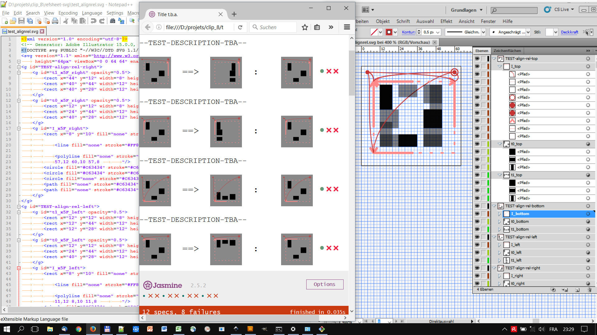

`Clip_8`
========

`Clip_8` is an iconic programming language inspired by _paper manipulation_ operations. `Move`, `align`, `cut`, `transform` are all operations that can be intuitively comprehended as manipulations of cartonage pieces. These external counterparts serve as physical models for elementary mental concepts of calculation.

While each operation applies to graphical content, the instructions, in turn, are themselves given in a graphical form.

The current Javascript implementation of the _interpreter_ operates on _inline SVG_ elements in the Document Object Model (DOM) in a browser, entirely on the client side.

Language documentation / Engine tests
-------------------------------------

The integration tests are arranged in [Reference Test Sheets](https://broesamle.github.io/clip_8/tests/) which serve as _language reference_, simultaneously.

Compatibility / Browser support
-------------------------------

Clip_8 makes extensive use of _inline SVG_, _Javascript_, and the _DOM_. Not all browsers implement all required parts of the
[SVG DOM Interface](https://www.w3.org/TR/SVG11/struct.html#DOMInterfaces]), i.e. `SVGElement.getIntersectionList` provides crucial functionality (successfully tested only in Chrome, at the time of writing).

Please check [Issue 9]https://github.com/broesamle/clip_8/issues/9 and related issues for more information on browser support.

Demos
-----

[Loom Demo](https://broesamle.github.io/clip_8/demos/loom3.html)

Copyright
---------

Copyright 2016, 2017 Martin Brösamle.

License
-------

+ The source code of the `Clip_8` interpreter (especially `*.js` files), the related page generators (especially `*.py`), and other portions of the distribution not explicitly licensed otherwise, are licensed under the GNU GENERAL PUBLIC LICENSE -- see the `LICENSE-GPL` file in this directory for details.

+ Demos and graphics (especially `*.svg`, `*.pdf`, `*.jpg`, `*.png` files) are licensed under a [Creative Commons Attribution-NonCommercial-ShareAlike 4.0 International Public License](https://creativecommons.org/licenses/by-nc-sa/4.0/legalcode) -- see `LICENSE-CC-BY-NC-SA` file in this directory for details.
